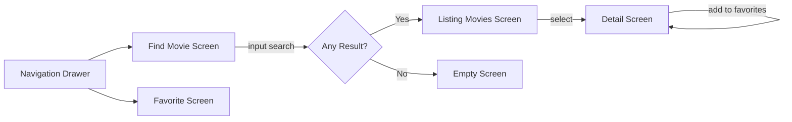
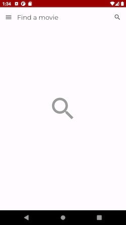
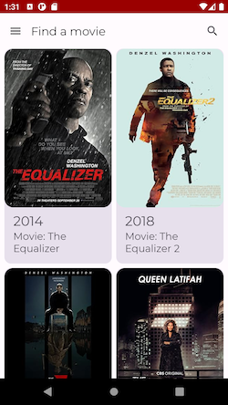
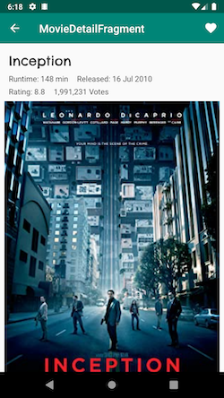
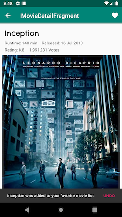
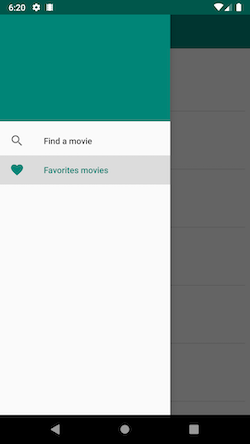
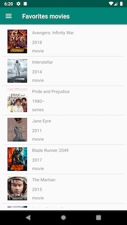

# Movies


# Table of Contents

1. [Description](#description)
   1. [Skills you may find in this project](#skills-you-may-find-in-this-project)
   2. [Flowchart](#flowchart)
   3. [Screenshots](#screenshots)
2. [Useful Resources](#useful-Resources)
3. [Conferences](#conferences)
4. [Youtube Channels](#youtube-channels)
5. [Other Project Samples](#other-project-samples)
6. [Community](#community)

# Description

With this demo app you may search movies by name, see the details of it, or mark it as a favorite
one.
Moreover, you will find a section listing favorite movies you chose.

## Skills you may find in this project

| Jetpack       | Kotlin & Quality    | Dependency Management | Others          |
|---------------|---------------------|-----------------------|-----------------|
| `Compose`     | `Coroutines`        | `Version Catalogs`    | `Landscapist`   |
| `WorkManager` | `Asynchronous Flow` | `Gradle Kotlin DSL`   | `Atomic Design` |
| `Hilt`        | `Detekt`            |                       | `Material 3`    |
| `Room`        | `Ktlint`            |                       | `Retrofit`      |
| `Paging`      |                     |                       | `OkHttp`        |
| `Navigation`  |                     |                       | `Timber`        |
|               |                     |                       |                 |

## Flowchart



## Screenshots








# Android Platform Architecture


## Application Components
* Activities
* Services
* Broadcast receivers
* Content providers: https://developer.android.com/guide/topics/providers/content-providers

# Resources

* 📝 **Kotlin Docs:** https://kotlinlang.org/docs/home.html
* 🚀 **Kotlin Release:** https://github.com/JetBrains/kotlin/releases
* 📣 **Kotlin Blog:** https://blog.jetbrains.com/kotlin/
* 🎥 **Kotlin Youtube Channel:** https://www.youtube.com/channel/UCP7uiEZIqci43m22KDl0sNw
* 🤖 **Kotlin Reddit:** https://www.reddit.com/r/Kotlin/
* 🤯 **Kotlin StackOverflow:** https://stackoverflow.com/questions/tagged/kotlin
* 🗺️ **Kotlin Community:** https://kotlinlang.org/community/


* 📝 **Platform Architecture:** https://developer.android.com/guide/platform
* 👩‍💻👨‍💻 **Android Developers:** https://developer.android.com/
* **Android Jetpack:** https://developer.android.com/jetpack

#### Samples
 * [Sunflower][4]: A Demo app uses many different Jetpack components to demonstrate Android development best practices. Checkout the code [here][5].

### Clean Architecture


* [Clean Architecture: A Craftsman's Guide to Software Structure and Design Book][10] by Robert C. Martin (Uncle Bob)
* [The Clean Code Blog][7] by Robert C. Martin (Uncle Bob)
* [Android Architecture: Part 1 – Every New Beginning is Hard][8] by Tomislav Homan
* [Learn Clean Architecture for Android at Caster.io][11]

#### Samples
* [Android-CleanArchitecture][9] by Fernando Cejas
* [Android Clean Architecture Boilerplate][12]
* [Android Architecture Blueprints - MVP + Clean Architecture][13]

### MVVM
* [Android Architecture Patterns Part 3: Model-View-ViewModel][14] by Florina Muntenescu 
* [Why to choose MVVM over MVP — Android Architecture][15]

# Conferences
Look inside Videos in www.droidcon.com [website][16]

# Youtube Channels
* [Android Developers][17]
* [droidcon NYC][18]
* [Droidcon Italy][19]
* [droidcon SF][20]
* [droidcon Berlin][21]
* [Android Programming Dev tutorials][22]

# Other Project Samples

* MVI - RxJava with modules as layers [here][23]
* MVI - Kotlin Flow and modularization with dynamic features [here][24]
* Compose with Atomic Design approach [here][25]


[4]: https://medium.com/androiddevelopers/introducing-android-sunflower-e421b43fe0c2

[5]: https://github.com/android/sunflower

[6]: https://developer.android.com/training/dependency-injection/hilt-android

[7]: https://blog.cleancoder.com/uncle-bob/2012/08/13/the-clean-architecture.html

[8]: https://five.agency/android-architecture-part-1-every-new-beginning-is-hard/
[9]: https://github.com/android10/Android-CleanArchitecture
[10]: https://www.amazon.com/Clean-Architecture-Craftsmans-Software-Structure/dp/0134494164/ref=sr_1_2?ie=UTF8&qid=1541340796&sr=8-2&keywords=clean+architecture
[11]: https://medium.com/exploring-android/learn-clean-architecture-for-android-at-caster-io-8f1513621c30
[12]: https://github.com/bufferapp/android-clean-architecture-boilerplate
[13]: https://github.com/googlesamples/android-architecture/tree/todo-mvp-clean/
[14]: https://medium.com/upday-devs/android-architecture-patterns-part-3-model-view-viewmodel-e7eeee76b73b
[15]: https://android.jlelse.eu/why-to-choose-mvvm-over-mvp-android-architecture-33c0f2de5516
[16]: https://www.droidcon.com/
[17]: https://www.youtube.com/channel/UCVHFbqXqoYvEWM1Ddxl0QDg
[18]: https://www.youtube.com/channel/UCSLXy31j2Z0sdDeeAX5JpPw
[19]: https://www.youtube.com/channel/UC9f8652addezs8ZUuKPB4Ow
[20]: https://www.youtube.com/channel/UCKubKoe1CBw_-n_GXetEQbg
[21]: https://www.youtube.com/channel/UCF4O2pQ8vBV8YmSAWb5QRPw
[22]: https://www.youtube.com/channel/UCSwuCetC3YlO1Y7bqVW5GHg
[23]: https://github.com/4mr0m3r0/movies-mvi-sample
[24]: https://github.com/4mr0m3r0/movies-modularization-sample
[25]: https://github.com/4mr0m3r0/atomic-design-sample

License
-------
````
MIT License

Copyright (c) 2019 Angel Manuel Romero Alfonso

Permission is hereby granted, free of charge, to any person obtaining a copy
of this software and associated documentation files (the "Software"), to deal
in the Software without restriction, including without limitation the rights
to use, copy, modify, merge, publish, distribute, sublicense, and/or sell
copies of the Software, and to permit persons to whom the Software is
furnished to do so, subject to the following conditions:

The above copyright notice and this permission notice shall be included in all
copies or substantial portions of the Software.

THE SOFTWARE IS PROVIDED "AS IS", WITHOUT WARRANTY OF ANY KIND, EXPRESS OR
IMPLIED, INCLUDING BUT NOT LIMITED TO THE WARRANTIES OF MERCHANTABILITY,
FITNESS FOR A PARTICULAR PURPOSE AND NONINFRINGEMENT. IN NO EVENT SHALL THE
AUTHORS OR COPYRIGHT HOLDERS BE LIABLE FOR ANY CLAIM, DAMAGES OR OTHER
LIABILITY, WHETHER IN AN ACTION OF CONTRACT, TORT OR OTHERWISE, ARISING FROM,
OUT OF OR IN CONNECTION WITH THE SOFTWARE OR THE USE OR OTHER DEALINGS IN THE
SOFTWARE.
````
