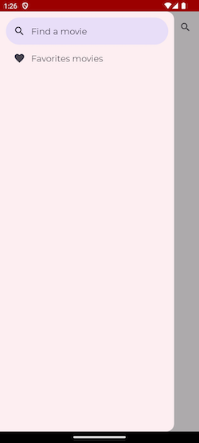

# Movies

# Table of Contents

1. [Description](#description)
   1. [Skills you may find in this project](#skills-you-may-find-in-this-project)
   2. [Flowchart](#flowchart)
   3. [Screenshots](#screenshots)
2. [Resources](#Resources)
3. [Conferences](#conferences)
4. [Youtube Channels](#youtube-channels)
5. [More Android Samples](#more-android-samples)

# Description

With this demo app you may search movies by name, see the details of it, or mark it as a favorite
one.
Moreover, you will find a section listing favorite movies you chose.

## Skills you may find in the code

| Jetpack       | Kotlin & Quality    | Dependency Management | Others          |
|---------------|---------------------|-----------------------|-----------------|
| `Compose`     | `Coroutines`        | `Version Catalogs`    | `Landscapist`   |
| `WorkManager` | `Asynchronous Flow` | `Gradle Kotlin DSL`   | `Atomic Design` |
| `Hilt`        | `Detekt`            |                       | `Material 3`    |
| `Room`        | `Ktlint`            |                       | `Retrofit`      |
| `Paging`      |                     |                       | `OkHttp`        |
| `Navigation`  |                     |                       | `Timber`        |
|               |                     |                       |                 |

## Design Patterns implemented in the code
| Creational | Structural | Behavioral              |
|------------|------------|-------------------------|
| Singleton  |            | Command                 |
|            |            | Chain of Responsibility |
|            |            | State                   |

## Flowchart

## Screenshots

# Resources

* 📝 **Kotlin Docs:** https://kotlinlang.org/docs/home.html
* 🚀 **Kotlin Release:** https://github.com/JetBrains/kotlin/releases
* 📣 **Kotlin Blog:** https://blog.jetbrains.com/kotlin/
* 🎥 **Kotlin Youtube Channel:** https://www.youtube.com/channel/UCP7uiEZIqci43m22KDl0sNw
* 🤖 **Kotlin Reddit:** https://www.reddit.com/r/Kotlin/
* 🤯 **Kotlin StackOverflow:** https://stackoverflow.com/questions/tagged/kotlin
* 🗺️ **Kotlin Community:** https://kotlinlang.org/community/

* 📝 **Platform Architecture:** https://developer.android.com/guide/platform
* 👩‍💻👨‍💻 **Android Developers:** https://developer.android.com/
* **Android Jetpack:** https://developer.android.com/jetpack

#### Samples
 * [Sunflower][4]: A Demo app uses many different Jetpack components to demonstrate Android development best practices. Checkout the code [here][5].

### Clean Architecture

* [Clean Architecture: A Craftsman's Guide to Software Structure and Design Book][10] by Robert C. Martin (Uncle Bob)
* [The Clean Code Blog][7] by Robert C. Martin (Uncle Bob)
* [Android Architecture: Part 1 – Every New Beginning is Hard][8] by Tomislav Homan
* [Learn Clean Architecture for Android at Caster.io][11]

#### Samples
* [Android-CleanArchitecture][9] by Fernando Cejas
* [Android Clean Architecture Boilerplate][12]
* [Android Architecture Blueprints - MVP + Clean Architecture][13]

### MVVM
* [Android Architecture Patterns Part 3: Model-View-ViewModel][14] by Florina Muntenescu 
* [Why to choose MVVM over MVP — Android Architecture][15]

# Conferences
Look inside Videos in www.droidcon.com [website][16]

# Youtube Channels
* [Android Developers][17]
* [droidcon NYC][18]
* [Droidcon Italy][19]
* [droidcon SF][20]
* [droidcon Berlin][21]
* [Android Programming Dev tutorials][22]

# More Android Samples
For more samples in this series of Android Development, please, feel free to check them. Each one of them 
cover an specific topic.  
* **Modularization by layers.** _Skills: MVI, RxJava._ 👉 https://github.com/4mr0m3r0/movies-mvi-sample
* **Modularization by features.** _Skills: MVI, Coroutines, Flow._ 👉 https://github.com/4mr0m3r0/movies-modularization-sample
* **Implementing a Design System.** _Skills: Jetpack Compose, Atomic Design Methodology._ 👉 https://github.com/4mr0m3r0/atomic-design-sample
* **Android Services.** _Skills: Services, Broadcast Receivers, Content Providers._ 👉 https://github.com/4mr0m3r0/android-services-sample 

[4]: https://medium.com/androiddevelopers/introducing-android-sunflower-e421b43fe0c2

[5]: https://github.com/android/sunflower

[6]: https://developer.android.com/training/dependency-injection/hilt-android

[7]: https://blog.cleancoder.com/uncle-bob/2012/08/13/the-clean-architecture.html

[8]: https://five.agency/android-architecture-part-1-every-new-beginning-is-hard/
[9]: https://github.com/android10/Android-CleanArchitecture
[10]: https://www.amazon.com/Clean-Architecture-Craftsmans-Software-Structure/dp/0134494164/ref=sr_1_2?ie=UTF8&qid=1541340796&sr=8-2&keywords=clean+architecture
[11]: https://medium.com/exploring-android/learn-clean-architecture-for-android-at-caster-io-8f1513621c30
[12]: https://github.com/bufferapp/android-clean-architecture-boilerplate
[13]: https://github.com/googlesamples/android-architecture/tree/todo-mvp-clean/
[14]: https://medium.com/upday-devs/android-architecture-patterns-part-3-model-view-viewmodel-e7eeee76b73b
[15]: https://android.jlelse.eu/why-to-choose-mvvm-over-mvp-android-architecture-33c0f2de5516
[16]: https://www.droidcon.com/
[17]: https://www.youtube.com/channel/UCVHFbqXqoYvEWM1Ddxl0QDg
[18]: https://www.youtube.com/channel/UCSLXy31j2Z0sdDeeAX5JpPw
[19]: https://www.youtube.com/channel/UC9f8652addezs8ZUuKPB4Ow
[20]: https://www.youtube.com/channel/UCKubKoe1CBw_-n_GXetEQbg
[21]: https://www.youtube.com/channel/UCF4O2pQ8vBV8YmSAWb5QRPw
[22]: https://www.youtube.com/channel/UCSwuCetC3YlO1Y7bqVW5GHg
